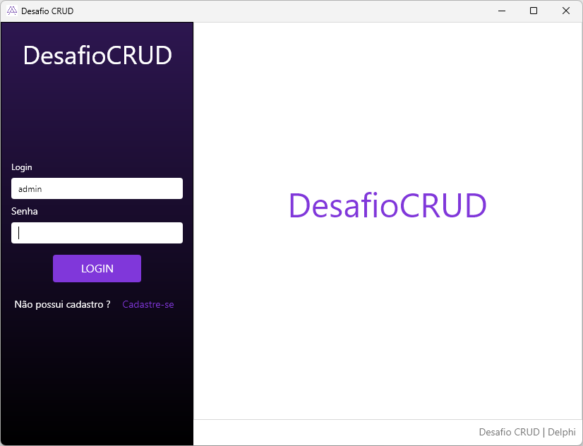
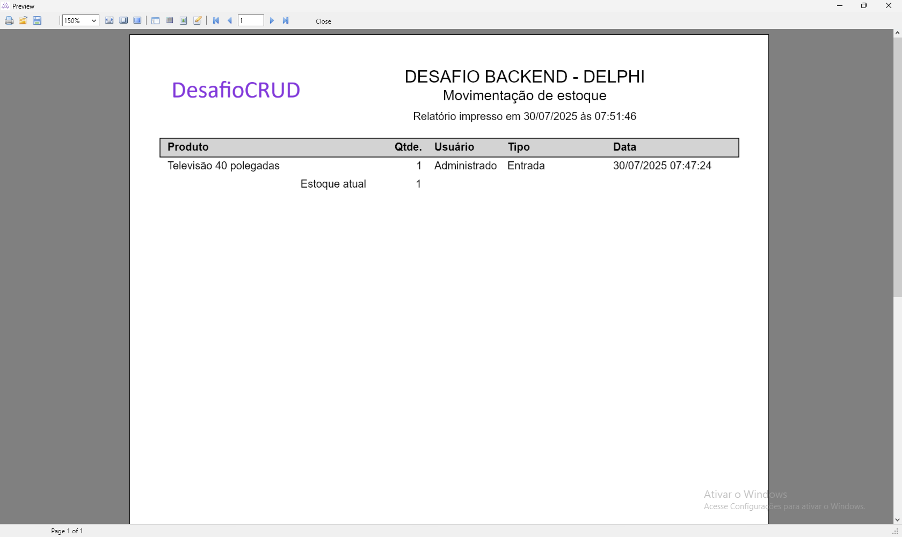

# 🚀 Desafio Técnico Delphi – Processo Seletivo 

**Autor:** Danilo Fois  
**Propósito:** Projeto desenvolvido como parte de um processo seletivo, com o objetivo de demonstrar conhecimento técnico em Delphi, arquitetura de software, boas práticas de programação e recursos visuais com FMX.

---

## 🎯 Objetivo do Projeto

Criar um sistema completo com as seguintes funcionalidades:

- CRUD com separação de responsabilidades (MVC + DAO)
- Login com criptografia de senha (BCrypt)
- Cadastro de Usuários, Categorias e Produtos
- Mestre-detalhe para movimentações de estoque
- Relatório de movimentações com FastReport
- Animações e design moderno com FMX

---

## ⚙️ Tecnologias e Bibliotecas

- **Delphi:** Projeto criado originalmente no Delphi Rio (10.3), compatível com versões superiores.
- **Firebird 4.0:** Banco de dados utilizado com procedures, triggers e índices otimizados.
- **FireDAC:** Conexão e manipulação de dados.
- **FastReport:** Geração de relatórios.
- **BCrypt:** Criptografia de senhas.
- **Skia4Delphi:** SVGs e animações visuais com FMX.
- **BOSS:** Gerenciador de dependências para Delphi (novidade nas melhorias recentes).

---

## 🧠 Arquitetura e Padrões

- **MVC (Model-View-Controller)**
- **DAO (Data Access Object)**
- **Padrão Singleton**
- **POO com uso de herança, overload, e generics**
- **Frames FMX para reuso de telas e componentes**
- **Validação de dados e segurança (parâmetros SQL para evitar SQL Injection)**

---

## 🖥️ Funcionalidades Desenvolvidas

- Tela de login com persistência via INI
- Cadastro de usuários com senha criptografada
- Cadastro de categorias e produtos
- Lançamento de movimentações de estoque (entrada e saída)
- Relatório de movimentações em FastReport
- Interface responsiva com animações (TAnimator)
- Armazenamento de configurações e conexão via INI

---

## 🔐 Banco de Dados

- Procedures para movimentações e controle de estoque
- Triggers para preenchimento automático de campos
- Relacionamentos com chaves primárias e estrangeiras
- Índices para desempenho em consultas

---

## 📦 Estrutura de Pastas

A partir das últimas melhorias, este projeto passou a utilizar o **BOSS** para gerenciamento de dependências, e por isso a pasta `modules` foi **removida do repositório**. Os pacotes podem ser restaurados facilmente com:

```bash
boss install
```

---

## 🔧 Melhorias Futuras

- Log de atividades (inclusões, edições, exclusões)
- Permissões por usuário
- Relatórios de cadastro de produtos e categorias
- Recuperação de senha
- Bloqueio de exclusão de produtos já movimentados
- Componente visual customizado para botões animados
- Centralização das cores e fontes do projeto
- Criação de container Docker com Firebird 4.0
- Utilização de interfaces
- RTTI para validação automática de campos

---

## 📝 Observações

Este projeto foi construído com foco em boas práticas, arquitetura limpa e utilização de recursos modernos do Delphi FMX. Ideal para demonstração de habilidades em desenvolvimento desktop com foco em qualidade visual, performance e organização de código.

---

## 🖼️ Screenshots

### 🔐 Tela de Login


### 🛒 Cadastro de Produto


### 📊 Relatório de Movimentações



> Repositório público para fins de portfólio técnico.
